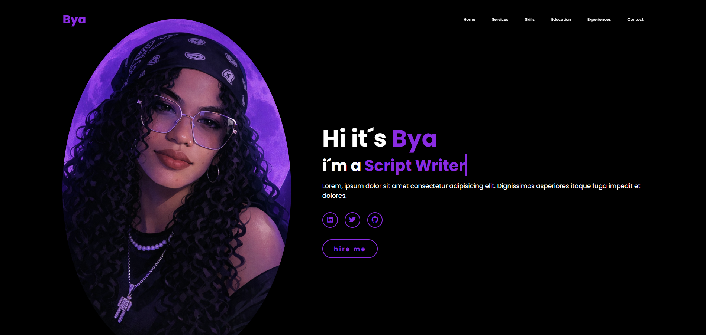

# 🖤 Purple Dark Portfolio | Bya

Portfólio pessoal com design moderno em tema escuro e destaque em roxo neon.

Projeto desenvolvido para apresentar minha identidade profissional, habilidades e experiências de forma visualmente impactante.

---

## 📸 Preview

Adicione aqui uma imagem do projeto:

---

## 🚀 Sobre o Projeto

Este é um site portfólio com foco em:

- 🎯 Apresentação pessoal
- 🛠️ Serviços oferecidos
- 💡 Habilidades técnicas
- 🎓 Formação acadêmica
- 💼 Experiências profissionais
- 📞 Contato

O layout combina minimalismo com contraste forte entre preto e roxo, criando uma identidade visual marcante.

---

## 🎨 Características do Design

- 🖤 Tema escuro (Dark UI)
- 💜 Destaques em roxo neon
- 🖼️ Hero section com imagem em destaque
- 🔗 Ícones sociais estilizados
- ✨ Botões com efeito hover
- 🧭 Navbar fixa com navegação

---

## 🛠️ Tecnologias Utilizadas

- HTML5
- CSS3
- Flexbox
- Responsividade
- Animações com CSS

---

## 💡 Objetivo

Este projeto foi criado para:

- Construir uma presença digital profissional
- Demonstrar habilidades em Frontend
- Criar um layout moderno e impactante
- Servir como portfólio online

---

## 🔮 Melhorias Futuras

- 🌙 Alternância entre Dark/Light mode
- 📱 Responsividade completa para mobile
- ✨ Mais animações interativas
- 🧠 Integração com backend para formulário de contato
- 🚀 Deploy com domínio personalizado

---

## 👩‍💻 Desenvolvido por

**Bya**

---

## ⭐ Se você gostou do projeto

Deixe uma estrela no repositório!
